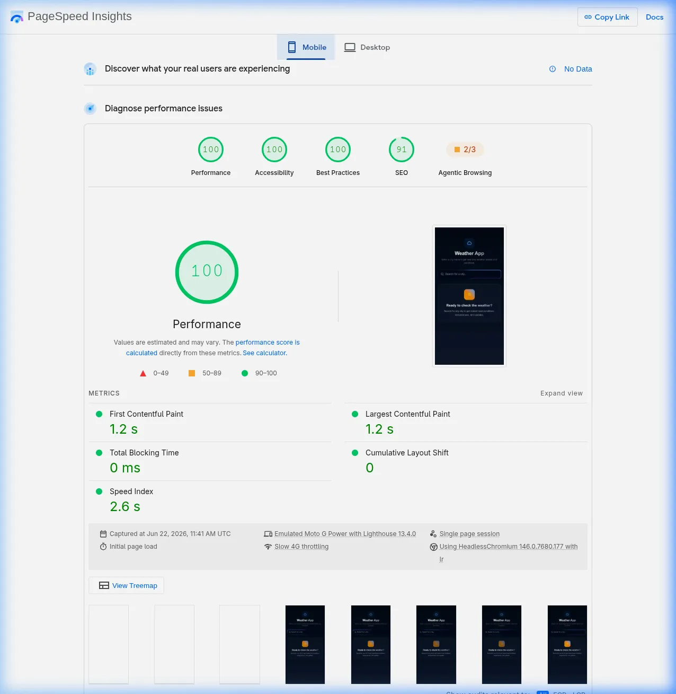
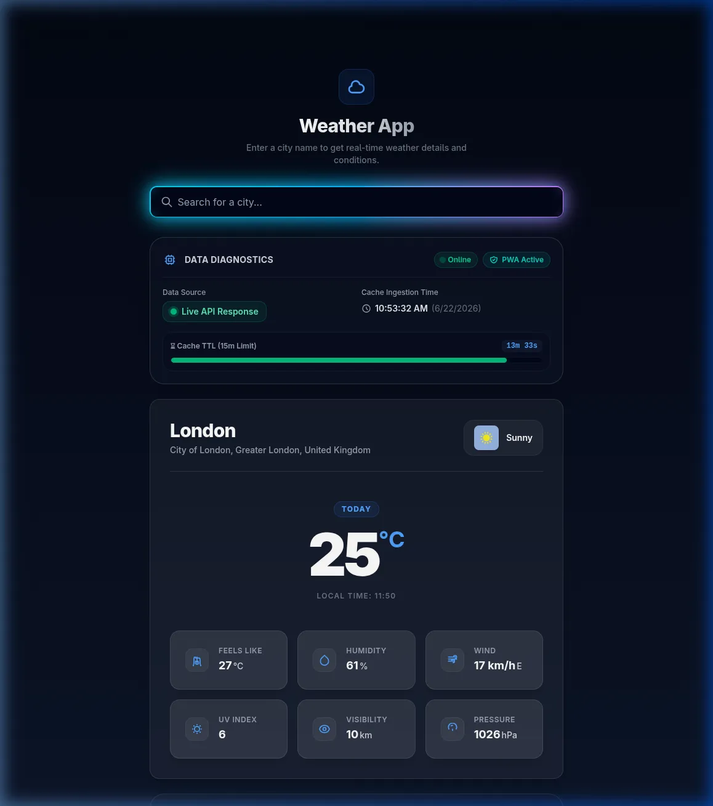

# Weather App

## Lighthouse Audit

We perform automated Lighthouse audits to ensure the weather application maintains the highest standards of performance, accessibility, best practices, and SEO. Here is the latest score breakdown from PageSpeed Insights:



---

## Live URL

[https://weather-app-jh-2026.web.app/](https://weather-app-jh-2026.web.app/)



---
<br><br>

# Development Environment

### Node Requirements

I only run Node.js locally in my projects to maintain stricter security measures. If you don't have Node.js installed, you may run the bash script `bash ./setup_node.sh`, which will download a portable Node.js environment with robust security verification. 

> **Note**: This script has only been tested on Linux systems.

> **Note**: Make sure to `export PATH="$PWD/bin:$PATH"` before executing any Node.js commands in your workspace's shell.

#### Required tools for script integrity and security
"curl" "sha256sum" - `sudo apt install curl sha256sum`
#### Optional tools for cryptographic verification (can be installed separately)
"gpgv" - `sudo apt install gpgv`

#### Node version

You are advised to change these variables in the script, depending on your needs:
```
VERSION="v22.12.0"
DISTRO="linux-x64"
```

---
### Local Development

To run this project locally, you will need to install dependencies.

```
npm install
npm run dev
```

Then navigate to `http://localhost:5173/` in your browser.

---
### CI/CD Pipeline

#### 1. `firebase-hosting-pull-request.yml`
* **Trigger:** `on: pull_request` (when you create or update a Pull Request targeting `main`).
* **Code State:** The code **has not** been merged yet.
* **Deploy Target:** Deploys to a **Preview Channel** (a temporary, auto-expiring URL unique to that PR, e.g., `project--pr-1-abcde.web.app`).
* **Purpose:** It lets you see and test your changes live on a secure URL *before* you merge them into production. The action will automatically post a comment on your PR with the link.

#### 2. `firebase-hosting-merge.yml`
* **Trigger:** `on: push` to `main` (when you push directly to `main`, or click the "Merge" button on an approved Pull Request).
* **Code State:** The code is now officially merged into `main`.
* **Deploy Target:** Deploys to the **Live Channel** (your production URLs: `project.web.app` and `project.firebaseapp.com`).
* **Purpose:** It publishes the finalized, approved changes to your live site for users.

#### 3. `deploy-backend.yml`
* **Trigger:** `on: push` to `main` (specifically when modifications are made to the `proxy/**` directory or the workflow file itself).
* **Code State:** The code is officially merged into `main`.
* **Deploy Target:** Builds and deploys the Go backend proxy binary to the **VPS Server** environment.
* **Purpose:** It compiles the Go proxy binary, transfers configuration files, and restarts the systemd service on the VPS server to handle production weather proxy requests securely.
---

### Notes

- **Why `VITE_` prefix for env vars?** Vite only exposes env vars prefixed with `VITE_` to client code via `import.meta.env`. This prevents accidentally leaking server-side secrets.
- **Weather stack api limitations:** The default api key will not work, you will need to obtain a free api key from https://weatherstack.com and replace the key in the `.env.development` file.
---
<br><br>

# Project Structure

The structure of the project follows a scalable, feature-based architecture. For example we may want to add google authentication then we would create a new directory `google-auth` inside the `features` directory and add the google authentication components, hooks, and types to that directory.  And also update the `src/features/index.ts` file to export the google authentication components, hooks, and types. 

Another feature which would be quite nice is a calendar. Using google calendar api, to show if any meetings are on a rainy day. This would require more api keys and secrets, which will be obfuscated in our CI/CD pipeline. However we could add a simple note taking feature on the rainy days using local storage.

```
Base structure:

src/
├── components/          # Shared/reusable UI components
│   └── ui/              # Atomic UI primitives (Button, Card, Input, Spinner)
├── features/            # Feature modules (each self-contained)
│   └── weather/         # Weather feature
│       ├── components/  # Weather-specific components
│       ├── hooks/       # Weather-specific hooks
│       ├── types/       # Weather-specific TypeScript types
│       └── index.ts     # Public API barrel export
├── hooks/               # Shared custom hooks
├── services/            # API service layer
│   └── api.ts           # Base fetch wrapper
├── types/               # Shared TypeScript types/interfaces
│   └── index.ts
├── utils/               # Utility functions
│   └── index.ts
├── config/              # App configuration
│   └── index.ts         # Environment variables, constants
├── App.tsx
├── main.tsx
└── index.css
```

#### Concepts

Here are the key concepts and patterns used in this project:

* **Barrel Exports** - Using barrel exports to provide a clean and organized way to import components, hooks, types, and services from a feature module. This allows you to import from a feature module without reaching into internal sub-directories. For example we import from `weather` directory instead of `weather/components`, `weather/hooks`, `weather/types`, etc.
* **Feature-Based Architecture** - Organizing the codebase by feature modules rather than by type (e.g. putting all components in one folder, all hooks in another, etc.). This makes it easier to understand, maintain, and scale the codebase as it grows.
* **Single Responsibility Principle** - Each component, hook, and type should have a single responsibility. This makes the codebase easier to understand, maintain, and scale.
* **Config Object pattern** - Using a config object to store all environment variables and constants. This makes it easier to manage and update the configuration. In this specific case we have frozen the config object to prevent it from being modified at runtime. You can review in `src/config/index.ts`. 
* **Component composition** - SearchBar uses Input, WeatherCard uses Card and WeatherDetails. This demonstrates composability.
* **Responsive design with Tailwind** - Using `grid-cols-1 md:grid-cols-3` is a mobile-first approach. Tailwind's breakpoint prefixes (`sm:`, `md:`, `lg:`) are just `@media (min-width: ...)` under the hood.
---
<br><br>

# Weather Feature

```
[Weather API types](./src/features/weather/types/index.ts)

   interface WeatherLocation {
     name: string;
     country: string;
     region: string;
     lat: string;
     lon: string;
     localtime: string;
   }
   interface WeatherCurrent {
     temperature: number;
     weather_descriptions: string[];
     weather_icons: string[];
     wind_speed: number;
     wind_dir: string;
     humidity: number;
     feelslike: number;
     uv_index: number;
     visibility: number;
     pressure: number;
     cloudcover: number;
     precip: number;
   }
   interface WeatherStackResponse {
     request: { type: string; query: string; language: string; unit: string };
     location: WeatherLocation;
     current: WeatherCurrent;
   }
   interface WeatherStackError {
     success: false;
     error: { code: number; type: string; info: string };
   }
   
   type WeatherStackAPIResponse = WeatherStackResponse | WeatherStackError;
```

#### Concepts

* **Type guard** - `isWeatherStackError` is a type guard function that narrows the union type `WeatherStackAPIResponse` to `WeatherStackError` when `success` is `false`. This allows TypeScript to infer the correct type in conditional branches.
* **Discriminated unions** - `WeatherStackAPIResponse` is a discriminated union of `WeatherStackResponse` and `WeatherStackError`.
* **Separation of concerns** - The service layer knows how to call the API, but components only know what data they need. [weatherService.ts](./src/services/weatherService.ts) is an example of a service having separation of concerns, as it is easily testable and allows us to switch to OpenWeatherMap if needed.
* **Custom hook** - `useWeather` is a custom hook that encapsulates the logic for fetching and managing weather data. It uses `useState`, `useRef`, and `useCallback` to manage the state of the weather data, loading state, and error state.
---
<br><br>

# Core UI Components (Atomic Design)

#### Concepts

* **Atomic Design** - "Atomic Design" is a methodology for creating design systems and component libraries, popularized by Brad Frost. Here are our Weather Apps core components:  
    * **Card**: A presentational container styled with a glassmorphic look (rounded corners, subtle border, semi-transparent background) that wraps content like a card. It's a presentational component that accepts `children` and `className` props, with a default glassmorphic style that can be customized via the `className` prop.
    * **Input**: A controlled text input component that accepts a value prop and onChange handler, with built-in support for submission via the Enter key. It also includes client-side debouncing to limit the rate of submission events. We extend `React.InputHTMLAttributes<HTMLInputElement>` so that we can expose HTML properties like placeholder, disabled, aria-label, etc.
    * **Spinner**: A presentational component that displays a loading spinner (a spinning circle) using CSS animations, with support for a `size` prop to control its dimensions. 
    * **ErrorMessage**: A presentational component that displays an error message with an optional retry button, using a simple card layout with error-themed styling (red/orange tint, warning icon).
* **Classname merger utility** - Using a classname merger utility allows us to combine class names in a clean manner. Our current custom `cn` function filters out truthy class names and joins them. In a larger production app, we would install `clsx` and `tailwind-merge` to resolve complex class overrides.
```typescript
export function cn(...classes: (string | undefined | null | false)[]): string {
  return classes.filter(Boolean).join(' ');
}
```
* **No icon library** - I'm a big fan of SVG icons. In previous projects using a Go webserver to render HTML, I have built my own utility around SVG to handle customizing stroke/fill colors, stroke-width, etc. I understand the trade-offs of using libraries like `react-icons`, which shifts your dependency to the library for faster developer velocity and easier readability. However, I am still a fan of SVGs and think they are a lovely piece of tech to work with.
---
<br><br>

# Error Handling

#### Concepts

* **AbortController** - We make use of `AbortController` to enforce request timeouts. The atomic component `Input.tsx` allows `onSubmit` only on keydown `Enter` which means we do not have to worry about **network race conditions**. However if we were to allow search on type we have the infrastructure to prevent a **network race condition**.
* **Input validation at multiple layers** - Because our `SearchBar.tsx` handles `.trim()` and check conditions around empty requests, we can focus on the `useWeather` hook to handle error handling for API responses. If a developer later makes a mistake in the code where an empty value is passed to `fetchWeather`, it will be handled gracefully as `getWeatherByCity` throws an error if the city name is empty.
* **Empty states** - It's bad UX practice to show blank/empty states, so a Welcome UI State is displayed while waiting for the user to request weather.
---
<br><br>

# Accessibility

#### Concepts

* **ARIA live region** - We add `aria-live="polite"` to the weather results container to announce updates to screen readers. We use `tabIndex={-1}` on the `<main>` element to support the "Skip to content" link behavior.
* **sr-only pattern** - We use `sr-only` class to hide content visually but keep it in the accessibility tree for screen readers. 
* **Roles** - We assign `role="search"`, `role="main"` `role="alert"` to the `SearchBar`, `main` and `ErrorMessage` components respectively to provide additional context for screen readers.
* **Busy** - Adding `aria-busy={isLoading}` to the `<section>` element that will display the `WeatherCard` this is wrapped in a condition to only show this section when `isLoading` is `false` so this will assist the reader to know that the App is no longer busy after the result is displayed.
---
<br><br>

# Testing

#### Concepts
* **JSDom** - configured `vite.config.ts` to use JSDom and created `setup.ts` to register it globally. By importing it globally once in `setup.ts`, these custom matchers are injected into the global `expect` namespace so they are available in every test file without having to import it at the top of every single file.
* **Centered Mock Fixtures** - moved the mocks being used in `weatherService.test.ts` and `useWeather.test.ts` to `fixtures.ts` as they were repeated. Centralized mock data prevents duplication and makes tests maintainable. When the API response shape changes, update one fixture.
---
<br><br>

# Proxy

* **Go Webserver** - I have created a lightweight Go backend webserver located in the [proxy](./proxy) directory, which acts as a secure intermediary between our front-end application and the external WeatherStack API. To showcase systems and infrastructure engineering capabilities, I configured a full deployment pipeline on a cloud VPS:
  - **Nginx Reverse Proxy**: Automatic configuration scripts to handle incoming HTTP/HTTPS traffic and route it to our Go daemon.
  - **SSL/TLS Termination**: Automated Let's Encrypt certificate generation scripts.
  - **Credentials Security**: Keeps the API credentials safely stored on the server rather than exposing them to client-side browsers.

  For more detailed instructions, configuration variables, and VPS deployment guidelines, you can read further in the [Go Proxy README](./proxy/README.md).
---
<br><br>

# 3 Day Feature

```
[Daily Weather API types](./src/features/weather/types/index.ts)
export interface DailyWeatherData {
  date: string;                  // YYYY-MM-DD format
  dayName: string;               // e.g. "Monday", "Yesterday", "Tomorrow"
  temperature: number;
  weather_descriptions: string[];
  weather_icons: string[];
  wind_speed: number;
  wind_dir: string;
  humidity: number;
  feelslike: number;
  uv_index: number;
  visibility: number;
  pressure: number;
}

export interface ExtendedWeatherResponse extends WeatherStackResponse {
  forecast: DailyWeatherData[];
  history: DailyWeatherData[];
}
```

* **Free Tier Issues** - The free tier for Weatherstack does not support forecast or historical data. So I have opted to mock out the forecast and historical data in the service layer. We offset the temperature by +/- 3 and the humidity by +/- 10. This is not a production-ready solution as it is not scalable and can lead to incorrect weather data being displayed. In a production environment we would use the paid tier for Weatherstack API, but the Interview Assessment specifically said use the free tier. I was also considering using a different API but did not want to stray from the assessment's guidelines.
* **Unidirectional Data Flow** - State originates in `useWeather` hook, flows down to `ForecastHistorySection` and `WeatherCard`, and callbacks (`onSelectDay`) flow back up to modify the state.
* **Open-Closed Principle** - We kept the `WeatherCard` component completely closed to modifications. Instead of adding conditional logic or creating a separate component, we used an Adapter Pattern in `App.tsx` to shape selected forecast/history days into the format `WeatherCard` already expects. Likewise, we created the `ForecastHistorySection` to extend the application's features without modifying the existing detail views.
* **Interactive Day Title (UX Enhancement)** - To improve visual clarity when shifting views, we implemented a new data point called `day_title` which dynamically updates the title above the temperature in `WeatherCard`. It defaults to "Today" for current conditions, and updates to the selected day's label (e.g., "Monday", "Yesterday") when clicking grid tiles. This is mapped via our parent adapter in `App.tsx`, preserving type-safety and following modular software design principles.
---
<br><br>

# Browser Storage and Service Workers

* **Lazy State Initialization** - Passing an anonymous function to `useState` (e.g., `useState(() => getInitialValue())`) rather than an inline evaluation (`useState(getInitialValue())`). The initializer function runs exactly once on mount, whereas inline evaluation runs on every single render. Since localStorage access is synchronous and slow (blocking the main thread), lazy initialization is crucial for performance.
* **QuotaExceededError Handling** - LocalStorage has a strict ~5MB limit. We wrap storage operations in try/catch blocks to prevent the app from crashing when storage is full or disabled (e.g., in incognito mode).
* **TTL Cache Rule** - We opt for **Active Invalidation** instead of **Passive Invalidation** since it has less overhead on the client. We only invalidate the cache on request, avoiding background sweep scripts.
* **SWR Cache Strategy** - We use the Stale-While-Revalidate (SWR) pattern to provide an instant, responsive user experience. This delivers a perceived performance improvement to the user's experience. The hook instantly renders stale cached data and triggers a background fetch to update the UI and cache silently, updating the `isStale` state to notify the UI when showing stale data.
* **Service Worker Lifecycle** - We register a service worker via `registerSW()` in `main.tsx` and use the `autoUpdate` option. This bypasses the browser's default waiting state, allowing the new service worker to skip waiting and activate immediately to serve fresh assets without requiring the user to close all open tabs.
* **PWA Caching Strategies** - We apply a **Cache-First** strategy for static assets (CSS, JS, images, icons) to allow instant offline rendering, and a **Network-First** strategy with a 24-hour cache expiration for dynamic weather API calls, ensuring the user gets fresh weather when online but falls back to the PWA cache when offline.
---
<br><br>